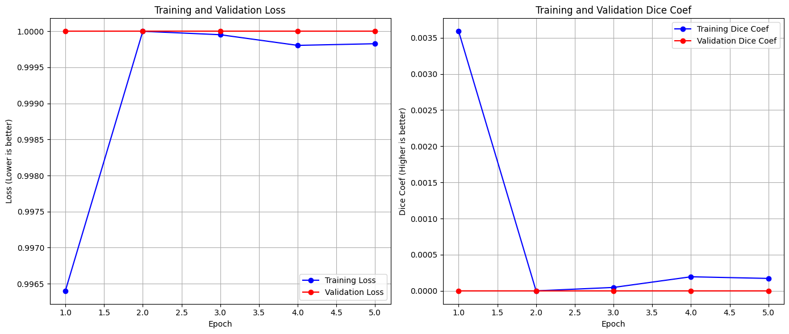
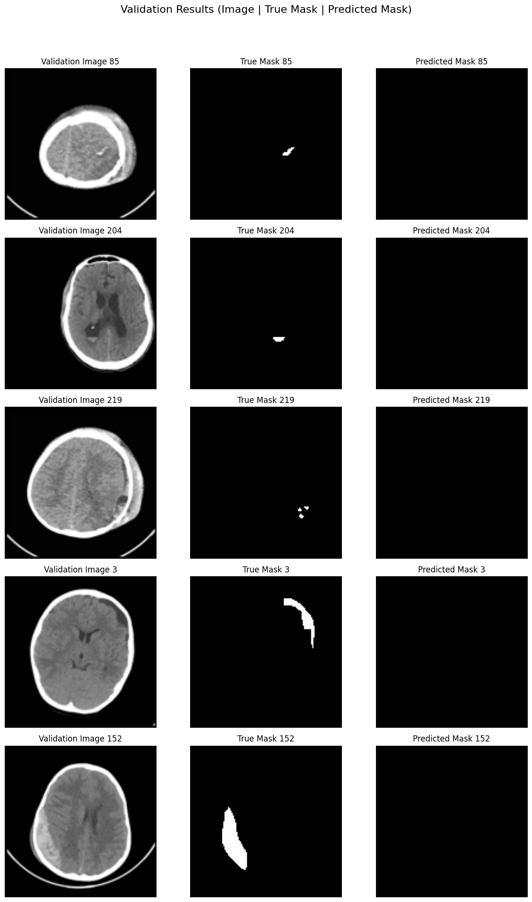

# Intracranial Hemorrhage Segmentation using U-Net (Prototype)

## Overview

This project implements a prototype deep learning model based on the U-Net architecture to segment intracranial hemorrhage (ICH) regions from brain CT scan slices. It demonstrates a complete workflow from data acquisition and preprocessing to model training and evaluation using Python, TensorFlow/Keras, and common data science libraries.

This was developed as a learning exercise and to demonstrate practical skills in applying deep learning to medical imaging challenges, particularly addressing data loading and preprocessing hurdles encountered with real-world datasets. It serves as a portfolio piece showcasing foundational abilities relevant to roles involving medical image analysis and deep learning.

## Dataset

*   **Source:** [Computed Tomography Images for Intracranial Hemorrhage Detection and Segmentation](https://www.kaggle.com/datasets/vbookshelf/computed-tomography-ct-images) on Kaggle.
*   **Original Authors:** Murtadha D. Hssayeni, M.S., Muayad S. Croock, Ph.D., Aymen Al-Ani, Ph.D., Hassan Falah Al-khafaji, M.D. and Zakaria A. Yahya, M.D. (Please refer to dataset page for full citation and license details).
*   **Format:** The dataset contains brain CT slices saved as individual JPG files (grayscale, different window settings available). Corresponding binary segmentation masks highlighting hemorrhage regions are also provided as JPG files (black background, white hemorrhage region) with the naming convention `[slice_number]_HGE_Seg.jpg`.
*   **Details:** Includes 82 CT scans (~2800 slices total), with 318 slices containing annotated hemorrhage masks.

## Methodology / Workflow

The project follows these key steps, implemented in the accompanying Colab notebook (`.ipynb`):

1.  **Setup:** Installation and import of necessary Python libraries (TensorFlow, Keras, NumPy, Matplotlib, Scikit-image, Scikit-learn, Kaggle API).
2.  **Kaggle API Configuration:** Setting up API credentials (`kaggle.json`) for direct dataset download.
3.  **Data Acquisition:** Downloading and unzipping the dataset from Kaggle.
4.  **Data Loading & Preprocessing:**
    *   Iterating through patient folders and `brain` subfolders.
    *   Identifying corresponding image and mask files (using the `_HGE_Seg.jpg` suffix).
    *   Creating blank masks for slices without hemorrhage annotations.
    *   Reading JPG images and masks.
    *   Resizing images and masks to a uniform size (e.g., 128x128) using `skimage.transform.resize` (nearest neighbor interpolation for masks).
    *   Normalizing image pixel values to the [0, 1] range.
    *   Thresholding resized masks to ensure binary (0/1) output.
    *   Adding a channel dimension for compatibility with Keras.
    *   Splitting the data into training and validation sets using `train_test_split`.
5.  **Model Definition:** Implementing a standard U-Net architecture using the Keras functional API (`Input`, `Conv2D`, `MaxPooling2D`, `concatenate`, `UpSampling2D`, `Dropout`, `sigmoid` output).
6.  **Model Compilation:** Configuring the model for training using the Adam optimizer and Dice Loss (`1 - Dice Coefficient`). Metrics tracked: Dice Coefficient and binary accuracy.
7.  **Training:** Fitting the model (`model.fit`) to the training data for a specified number of epochs, using the validation set to monitor performance. **GPU acceleration is essential for this step.**
8.  **Evaluation:**
    *   Plotting training and validation loss/metric curves over epochs.
    *   Generating predictions on the validation set.
    *   Visualizing side-by-side comparisons of input images, ground truth masks, and model-predicted masks.

## Tools and Libraries

*   Python 3.x
*   TensorFlow / Keras
*   NumPy
*   Matplotlib
*   Scikit-image
*   Scikit-learn
*   Kaggle API
*   Google Colab (for environment and GPU access)

## Results (Initial 5-Epoch Prototype Run)

The prototype model was trained for **5** epochs as an initial test of the pipeline.

*   **Training Performance (Epoch 5):**
    *   Training Dice Coefficient: ~1.8e-4 (0.00018)
    *   Training Binary Accuracy: ~99.81%
    *   Training Loss (Dice Loss): ~0.9998
*   **Validation Performance (Epoch 5):**
    *   Validation Dice Coefficient: ~6.2e-9 (Essentially 0.0)
    *   Validation Binary Accuracy: ~99.90%
    *   Validation Loss (Dice Loss): ~1.0000
*   **Learning Curves:**
    *(Insert screenshot of your Loss + Dice Coefficient plots from Cell 11 for the 5-epoch run here. Upload the image to your GitHub repo first.)*
    
    
    
    *(Comment briefly: "The plots show the initial training phase over 5 epochs. While loss decreased slightly, the Dice score remained near zero, indicating insufficient training time for the model to learn meaningful segmentation patterns. The high binary accuracy is misleading due to the significant class imbalance (most pixels are background).")*
*   **Sample Predictions:** Visualizations from the validation set after 5 epochs confirm the low Dice score, with the model primarily predicting blank masks.
    *(Insert one or two example screenshots from Cell 12 showing Image | True Mask | Predicted Mask for the 5-epoch run. Upload images first.)*
    
     
   
    

**Conclusion from this run:** This initial 5-epoch run confirms the data pipeline is working, but demonstrates that significantly more training time (more epochs) is required for the model to learn effective hemorrhage segmentation. The results highlight the importance of using appropriate metrics like Dice score over simple accuracy for imbalanced datasets. See the "Future Work" section for planned improvements, including longer training.

## Challenges & Learnings

This project involved significant debugging, providing valuable learning experiences:

*   **Dataset Structure:** The initial file path assumed after unzipping was incorrect due to an extra parent directory created by the Kaggle download/unzip process. This required inspecting the file system and correcting the `DATA_ROOT` path in the loading script.
*   **Mask Filename:** The script initially failed to find mask files because the assumed filename (`[num]HGE_Seg.jpg`) was missing an underscore present in the actual files (`[num]_HGE_Seg.jpg`). Manual inspection using the file browser and correction of the filename pattern were necessary.
*   **Mask Loading & Thresholding:** This was the most challenging part. Ensuring the mask files (read as 0-255 `uint8`) were correctly converted to binary (0.0-1.0 `float32`) masks *after* resizing required iterative debugging. Adding print statements to check raw, resized, and processed mask values helped pinpoint that the thresholding logic needed adjustment (`> 128`) to reliably capture the white hemorrhage pixels after potential floating-point variations from resizing.
*   **Colab Environment:** Remembering to re-upload `kaggle.json` and re-run API setup (Cell 3) after kernel restarts (especially when switching to GPU) is crucial for interacting with the Kaggle API.

## How to Run

1.  Open the `.ipynb` notebook file in Google Colab.
2.  Ensure you have a `kaggle.json` API key file from your Kaggle account.
3.  Change the runtime type to use a **GPU** (`Runtime` -> `Change runtime type` -> `GPU`). The kernel will restart.
4.  Upload your `kaggle.json` file using the file browser (folder icon on the left).
5.  Run the cells sequentially from top to bottom.
    *   Cell 3 configures the Kaggle API.
    *   Cell 4 downloads and unzips the data (may take time).
    *   Cell 10 trains the model (requires GPU).

## Future Work & Improvements

*   **Train Longer:** Increase the number of epochs significantly (e.g., 50+).
*   **Data Augmentation:** Implement image augmentation (rotation, flips, brightness, etc.) to improve model robustness and handle the limited data size.
*   **Hyperparameter Tuning:** Experiment with learning rate, batch size, optimizer, and potentially U-Net architecture variations.
*   **Loss Functions:** Explore combined Dice + BCE Loss or Focal Loss.
*   **Input Size:** Test with larger image dimensions (e.g., 256x256) if resources permit.
*   **Patient-Level Split:** Implement a more robust validation split based on patient IDs.
*   **Explore 3D U-Net:** Adapt the pipeline for true volumetric segmentation.
